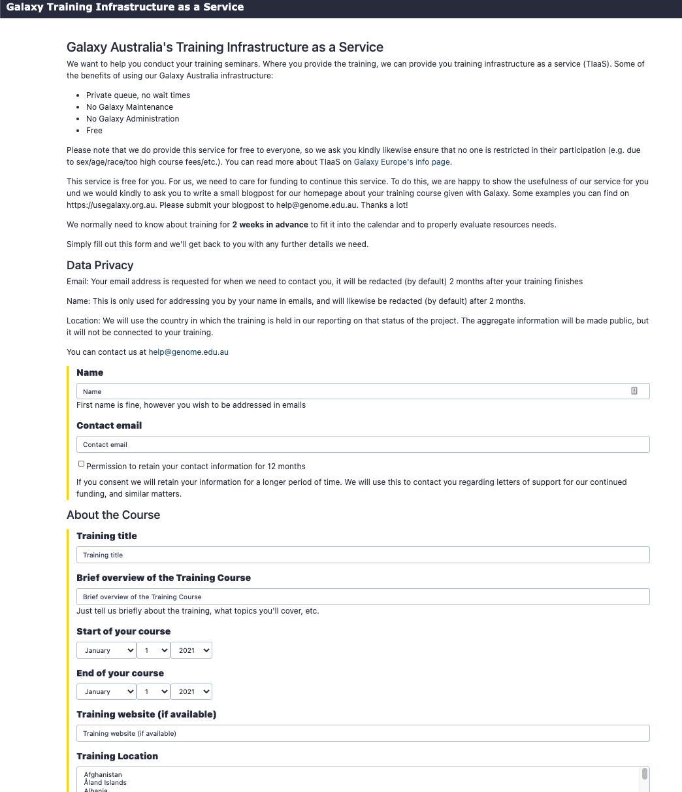
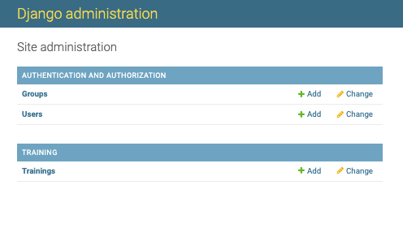
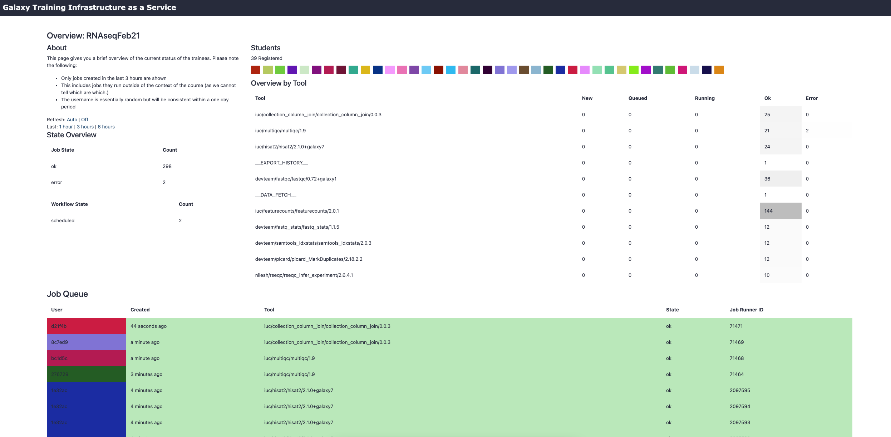
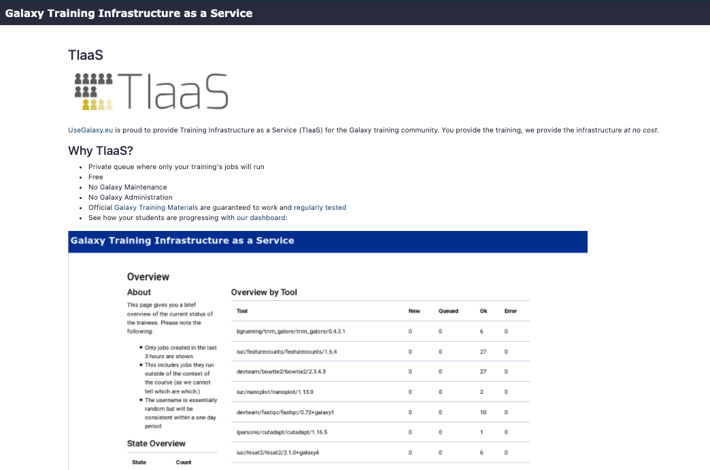
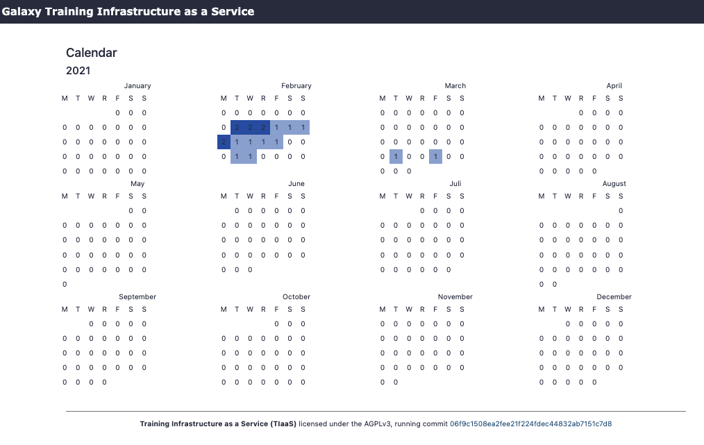
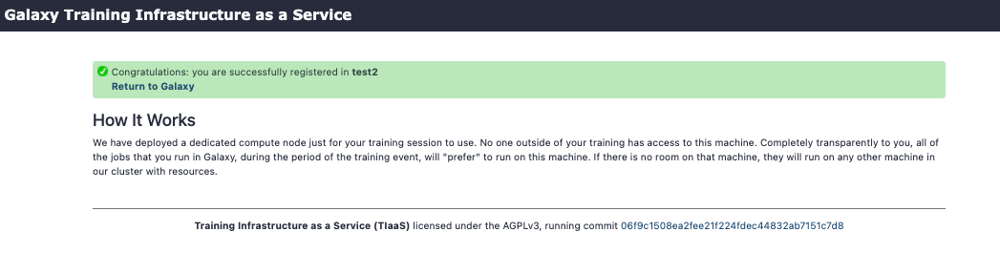

# Galaxy Australia TIaaS

This is the documentation for the Galaxy Australia implementation of Galaxy Europe's Training infrastructure as a service system (TIaaS).

## Background

Galaxy is widely used for teaching. In order to facilitate instructors, Galaxy Europe developed Training Infrastructure as a Service (TIaaS) and Galaxy Australia has implemented it. Workshop instructors can apply for TIaaS, and on the day of their workshop, their participants will be placed in a special group and use dedicated resources, thus reducing queue times on the day of the training.

TIaaS is a Django application that runs on the Galaxy Australia Web Server. It is installed and configured by an ansible role `usegalaxy-eu.tiaas2`. Configuration details can be found at the Galaxy Australia infrastructure git repo: [https://github.com/usegalaxy-au/infrastructure](https://github.com/usegalaxy-au/infrastructure)

## Structure

There are a number of web URL's associated with TIaaS at Galaxy Australia. They are:

| URL | Use | Who should use it
|-----|-----|------------------
| https://usegalaxy.org.au/tiaas/ | About TIaaS | Everyone
| https://usegalaxy.org.au/tiaas/new/ | Request a new TIaaS training | Instructors
https://usegalaxy.org.au/tiaas/admin/ | Approve and Manage requests	| Admin
https://usegalaxy.org.au/tiaas/stats/ | Overall TIaaS statistics ([Stats](https://usegalaxy.org.au/tiaas/stats/))	| Admins, Funding Agencies
https://usegalaxy.org.au/tiaas/calendar/ | Calendar of trainings ([Calendar](https://usegalaxy.org.au/tiaas/calendar/)) | Admins, Funding Agencies
https://usegalaxy.org.au/join-training/<training-id\> | Join a TIaaS training | Participants
https://usegalaxy.org.au/join-training/<training-id\>/status | Dashboard with job states of trainees | Instructors

### User application form

This is a typical web form that the user has to fill in to apply for a TIaaS allocation for their workshop. The more detail entered here the better so Galaxy Australia admins can make better infrastructure allocations.

Upon submission of the form, the application will email the Galaxy Australia help system with the details.

### Admin panel

This is a Django generated page so admins can interact with the database behind the TIaaS application. Mostly, admins will use the `Trainings` sub page. This is where they can approve or reject applications.

### Trainer's dashboard

This page shows the progress of the trainees in a particular workshop. Including where the student's jobs are at and recent job completions/errors etc.

### Other pages

#### - About TIaaS

A description of TIaaS.

#### - Calendar

A calendar showing the number of TIaaS events on any particular day

#### - Stats

A page showing statistics of TIaaS use for Galaxy Australia

#### - Join message

The message shown to trainee's upon their joining a particular training event

####

### Job configuration

TO DO

## Procedure

### 1. Application for training infrastructure

A prospective workshop trainer fills in the TIaaS application form - including details on:

* Dates
* Estimated number of students
* Training material to be used (GTN or otherwise)
* A short name for the course to be used in the "join" URL
* Other details of the workshop to help with admin approval process

See the form for details

Once the form is submitted, a ticket will be emailed to the Galaxy Australia helpdesk.

### 2. Admin approval/rejection

* The TIaaS admin receives/is assigned the event ticket in the online support pages.
* Admin logs into the TIaaS admin page
* Admin clicks on *Trainings* and then the name of the new workshop application.
* Admin then: 
    * checks the details of the training
    * makes any notes of tools/workflows that will be used
    * Either approves or rejects the application (consulting Service Manager).
* Emails the applicant outling the decision including:
    * Join training URL for participants
    * Quick explanation of the training status page
    * Ask trainer to reply with feedback post workshop

### 3. Provision of infrastructure - queue

* Under current system for GA - 
    * Make sure that training users are going to be sent to appropriate queue

### 4. Monitoring of training workshop(s)

* Trainer can monitor the workshop via the status page

### 5. Removal of training group post workshop

* The day after the conclusion of the workshop, Admin deletes the appropriate training group using `gxadmin`

        gxadmin mutate delete-group-role <group_name> [--commit]
        
 - where `<group_name>` is `training-` followed by the short name used in the training URL.

This command will delete the group/role from Galaxy and remove any user associations with it to allow all users access back into the main queue.

## Other notes:

**GDPR compliance:** 

Since this setup tracks additional personal information (submitter name & email, users in the queue view), TIaaS includes some always-on features to assist with your GDPR compliance.

* Users in public status dashboard are only visible by an anonymized identifier and colour
* Email addresses in the TIaaS admin panel will be automatically expunged 60 days after a training event

**To Do:**

* Customise the html templates to configure for Galaxy Australia's ecosystem
* Job configuration details
